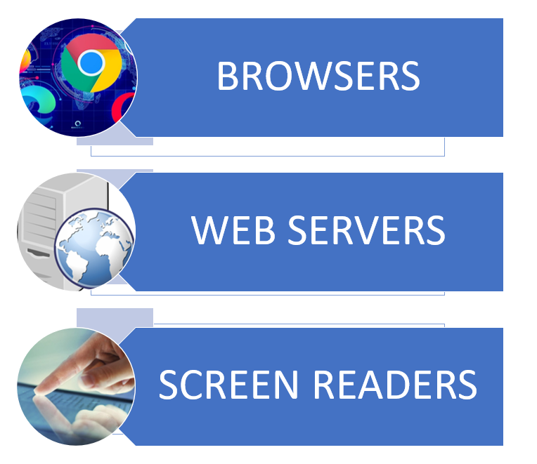
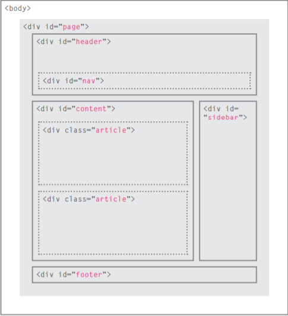
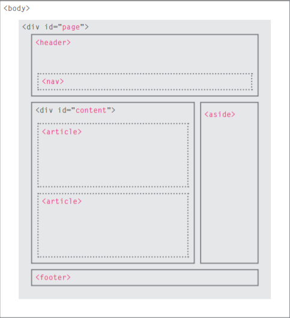
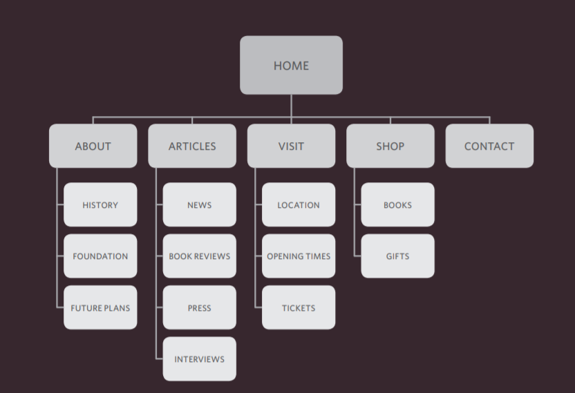
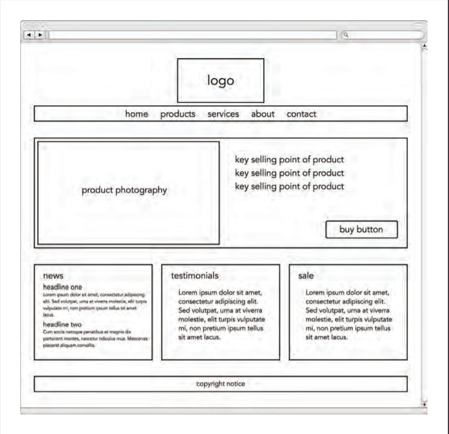

# Html and CSS  
 ## ***Inroduction***  
  - **html** used tags or elements to words so the browser know the heading, and where the paragraph stars and ends.  
   
    
 - **CSS** have wide variety of properties generally falled into two catagories:  
   - ***Presentation***: How to control
things like the color of text, the
fonts you want to use and the
size of those fonts, how to add
background colors to pages (or
parts of a page), and how to add
background images.  
   - ***layout*** : How to control where
the different elements are
positioned on the screen.

## **We can access the web using these three ways**

## **Page Stucture**
1. **what** is page stuctures?  
In addition to defining individual parts of your page (such as "a paragraph" or "an image"), HTML also boasts a number of block level elements used to define areas of your website (such as "the header", "the navigation menu", "the main content column"). This article looks into how to plan a basic website structure, and write the HTML to represent this structure.

2. **why** do we use page strucute?  
structure is very important in helping
readers to understand the messages you are trying to convey
and to navigate around the document.
3. **how** do we use page strucute?
 

## **The Evolution of HTML**
Each new version was designed
to be an improvement on the
last (with new elements and
attributes added and older code
removed).   
There have also been several
versions of each browser used to
view web pages, each of which
implements new code. Not all
web users, however, have the
latest browsers installed on
their computers, which means
that not everyone will be able to
view all of the latest features and
markup.
Where you should be
particularly aware of browsers
not supporting certain features.  
###  **HTML5**
in HTML5, web page authors do
not need to close all tags, and
new elements and attributes will
be introduced. At the time of
writing, the HTML5 specification
had not been completed, but
the major browser makers had
started to implement many of
the new features, and web page
authors were rapidly adopting
the new markup. 
 
##### ***DOCTYPE html***  
Because there have been
several versions of HTML, each
web page should begin with a
DOCTYPE declaration to tell a
browser which version of HTML
the page is using (although
browsers usually display the
page even if it is not included).  

##### ***Comments in HTML***  
If you want to add a comment
to your code that will not be
visible in the user's browser, you
can add the text between these
characters:
   
&nbsp;  

##### ***ID Attribute***  
Every HTML element can carry
the id attribute. It is used to
uniquely identify that element
from other elements on the
page. Its value should start with
a letter or an underscore (not a
number or any other character).
It is important that no two
elements on the same page
have the same value for their id
attributes (otherwise the value is
no longer unique).  
##### ***Class Attribute***
Every HTML element can
also carry a class attribute.
Sometimes, rather than uniquely
identifying one element within
a document, you will want a
way to identify several elements
as being different from the
other elements on the page.
For example, you might have
some paragraphs of text that
contain information that is more
important than others and want
to distinguish these elements, or
you might want to differentiate
between links that point to other
pages on your own site and links
that point to external sites
##### ***Block Elements***
Some elements will always
appear to start on a new line in
the browser window. These are
known as block level elements.    

##### ***Inline Elements***  
Some elements will always
appear to continue on the
same line as their neighbouring
elements. These are known as
inline elements. 

## **Html layout**  
HTML5 is introducing a new set of
elements that help define the structure of
a page.  
- ***Traditional HTML Layouts***  
For a long time, web page authors used "div" elements to group

together related elements on the page (such as the elements that form a
header, an article, footer or sidebar). Authors used class or id attributes
to indicate the role of the "div" element in the structure of the page. 

&nbsp;

&nbsp;

-***New Html5 Layout Elements*** 
&nbsp;

&nbsp;

-***Headers & Footers***  
The "header" and "footer"
elements can be used for:  
The main header or footer
that appears at the top or
bottom of every page on the
site.  
A header or footer for an
individual **article** or
**section** within the page.      
&nbsp;

-***Navigation***  
The "nav" element is used to
contain the major navigational
blocks on the site such as the
primary site navigation

**And There are many tags to use in Html version 5**...  
&nbsp;

## **Process & Design**
Every website should be designed for the
target audience—not just for yourself or the
site owner. It is therefore very important to
understand who your target audience is. 
&nbsp;

-***Why People Visit YOUR Website?***
Now that you know who your visitors are, you
need to consider why they are coming. While
some people will simply chance across your
website, most will visit for a specific reason.
&nbsp;
&nbsp;
### ***Question and Answer***
Q:what is the condition that the desginer must follow filling the website content?  
A: the content and design should be influenced by the goals of your users.
&nbsp;

### ***Site Maps***  
Now that you know what needs to appear
on your site, you can start to organize the
information into sections or pages.  
The aim is to create a diagram
of the pages that will be used
to structure the site. This is
known as a site map and it will
show how those pages can be
grouped.

&nbsp;

### **WireFrames**
A wireframe is a simple sketch of the key
information that needs to go on each page of a
site. It shows the hierarchy of the information
and how much space it might require.  
&nbsp;

