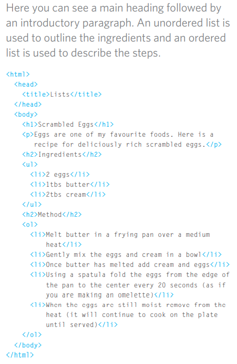

## lists in html
There are lots of occasions when we 
need to use lists. HTML provides us with 
three different types:  

- **Ordered lists** are lists where each item in the list is 
numbered. For example, the list might be a set of steps for 
a recipe that must be performed in order, or a legal contract 
where each point needs to be identified by a section 
number.  
- **Unordered lists** are lists that begin with a bullet point 
(rather than characters that indicate order).  
- **Definition lists** are made up of a set of terms along with the 
definitions for each of those terms.  

  

## Boxes
- By default a box is sized just big 
enough to hold its contents. To 
set your own dimensions for a 
box you can use the height and 
width properties.  
- The most popular ways to 
specify the size of a box are 
to use pixels, percentages, or 
ems. Traditionally, pixels have 
been the most popular method 
because they allow designers to 
accurately control their size.  
## Overflowing Content
The overflow property tells the 
browser what to do if the content 
contained within a box is larger 
than the box itself. It can have 
one of two values:  
1. ***hidden***    
2. ***scroll***  

JavaScript
## Arrays
An array is a special type of variable. It doesn't 
just store one value; it stores a list of values.   

### CREATING AN ARRAY 
You create an array and give it 
a name just like you would any 
other variable (using the var 
keyword followed by the name of 
the array). 
The values are assigned to the 
array inside a pair of square 
brackets, and each value is 
separated by a comma. The 
values in the array do not need 
to be the same data type, so you 
can store a string, a number and 
a Boolean all in the same array. 
### VALUES IN ARRAYS 
Values in an array are accessed as if they are in 
a numbered list. It is important to know that the 
numbering of this list starts at zero (not one). 

### ACCESSING & CHANGING VALUES IN AN ARRAY
The first lines of code on the left 
create an array containing a list 
of three colors. (The values can 
be added on the same line or on 
separate lines as shown here.) 
Having created the array, the 
third item on the list is changed 
from 'custom' to 'beige'. 
 ### using if.. else statment
 if ... e 1 se statement allows you 
to provide two sets of code: 
1. one set if the condition 
evaluates to true 
2. another set if the condition is 
false  
### SWITCH STATEMENTS
A switch statement starts with a 
variable called the switch value. 
Each case indicates a possible 
value for this variable and the 
code that should run if the 
variable matches that value. 

### descions and loops 
Conditional statements allow your code to make 
decisions about what to do next. 
Comparison operators (===, ! ==, ==, ! =, <, >, <=, =>) 
are used to compare two operands.
Logical operators allow you to combine more than one 
set of comparison operators. 
if ... else statements allow you to run one set of code 
if a condition is true, and another if it is false. 

