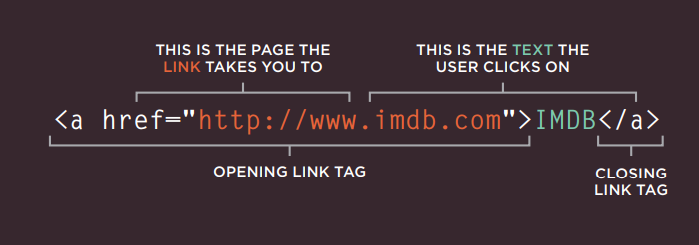
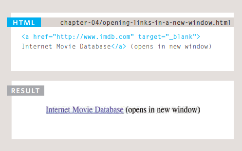
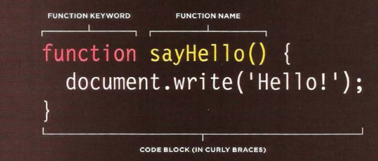
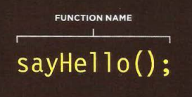

## Links
Links are the defining feature of the web 
because they allow you to move from 
one web page to another — enabling the 
very idea of browsing or surfing.  
&nbsp;
&nbsp;
&nbsp;

***Links*** are created using the 'a' element. Users can click on anything between the opening 'a' tag and the closing '/a' tag. You specify 
which page you want to link to using the href attribute.

## Linking to Other Pages on the Same Site
When you are ***linking*** to other 
pages within the same site, 
you do not need to specify the 
domain name in the URL. You 
can use a shorthand known as a 
relative URL.
## Directory Structure
On larger websites it's a good idea to organize your code by placing the 
pages for each different section of the site into a new folder. Folders on a 
website are sometimes referred to as directories.
## Opening Links in a New Window
If you want a link to open in a 
new window, you can use the 
target attribute on the opening 
"a" tag. The value of this 
attribute should be _blank.

## Summary Links
- Links are created using the "a" element
- The "a" element uses the href attribute to indicate 
the page you are linking to

# layout
## ***Building Blocks***
CSS treats each HTML element as if it is in its 
own box. This box will either be a block-level
box or an inline box.
## ***Controlling the Position of Elements***
CSS has the following positioning schemes that allow you to control 
the layout of a page: normal flow, relative positioning, and absolute 
positioning. You specify the positioning scheme using the position
property in CSS. You can also float elements using the float property.

## Functions,methods and objects
WHAT IS A **FUNCTION**?
Functions let you group a series of statements together to perform a 
specific task. If different parts of a script repeat the same task, you can 
reuse the function (rather than repeating the same set of statements). 
## **Declaring Functions**  

## **Calling Function**

## **6 Reasons for Pair Programming**
How does pair programming work?

**Why pair program?**
1. Greater efficiency
2. Engaged collaboration
3. Learning from fellow students
4. Social skills
5. Job interview readiness
6. Work environment readiness

