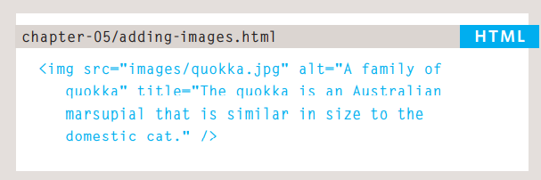

## **Images**
There are many reasons why you might 
want to add an image to a web page: you 
might want to include a logo, photograph, 
illustration, diagram, or chart.  

## **Choosing Images for Your Site**
A picture can say a thousand words, and great 
images help make the difference between an 
average-looking site and a really engaging one.
If you are building a site from scratch, it is good 
practice to create a folder for all of the images 
the site uses.  
As a website grows, keeping 
images in a separate folder 
helps you understand how the 
site is organized. Here you can 
see an example of the files for 
a website; all of the images are 
stored in a folder called **images.**
## **Add img**
To add an image into the page 
you need to use an "img"
element. This is an empty 
element (which means there is 
no closing tag). It must carry the 
following two attributes:

1. ### ***src*** 
This tells the browser where 
it can find the image file. This 
will usually be a relative URL 
pointing to an image on your 
own site. (Here you can see that 
the images are in a child folder 
called images.
### ***alt***
This provides a text description 
of the image which describes the 
image if you cannot see it.

## ***Three Rules for Creating Images*** 
There are three rules to remember when you 
are creating images for your website which are 
summarized below. We go into greater detail 
on each topic over the next nine pages.
Save images in 
1. the right format
2. Save images at the right size
3. Use the correct resolution

## **Foreground Color**
The color property allows you 
to specify the color of text inside 
an element. You can specify any 
color in CSS in one of three ways:
1. rgb values
2. hex codes
3. color names
## **background-color**
CSS treats each HTML element 
as if it appears in a box, and the 
background-color property 
sets the color of the background 
for that box.
## **Understanding Color**
Every color on a computer screen is created by mixing amounts of red, 
green, and blue. To find the color you want, you can use a color picker

## **Typeface Terminology**
- Serif
- Sans-Serif
- Monospace 
## **Units of Type Size**
- Pixels
- Percentages
- Ems
## JPEG vs PNG vs GIF — which image format to use and when?
- ### TL;DR
Use JPEG format for all images that contain a natural scene or photograph where variation in colour and intensity is smooth. Use PNG format for any image that needs transparency or for images with text & objects with sharp contrast edges like logos. Use GIF format for images that contain animations.
- Compression  
Almost all forms of data that we see on the internet — text, image, video etc. — are compressed to reduce the size of data and ensure faster transmission. Choosing the correct format and compression is a major factor that determines image size.
- Transparency  
In a simple form, transparency indicates something that is completely invisible. Logos and icons often need to be placed on backgrounds with variable colours. Hence it is desirable, that the background of these logos and icons is made transparent so that a single image can be used over multiple background variations.

