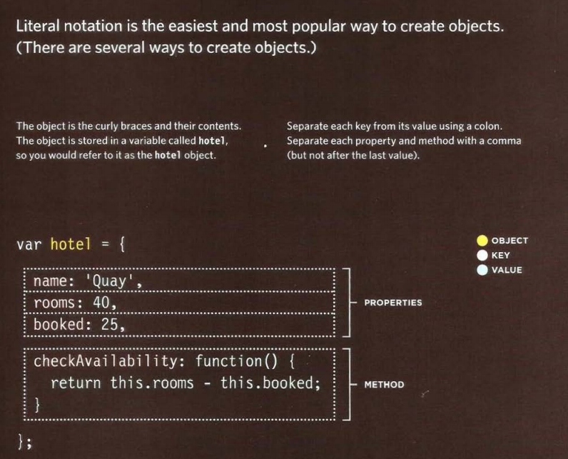
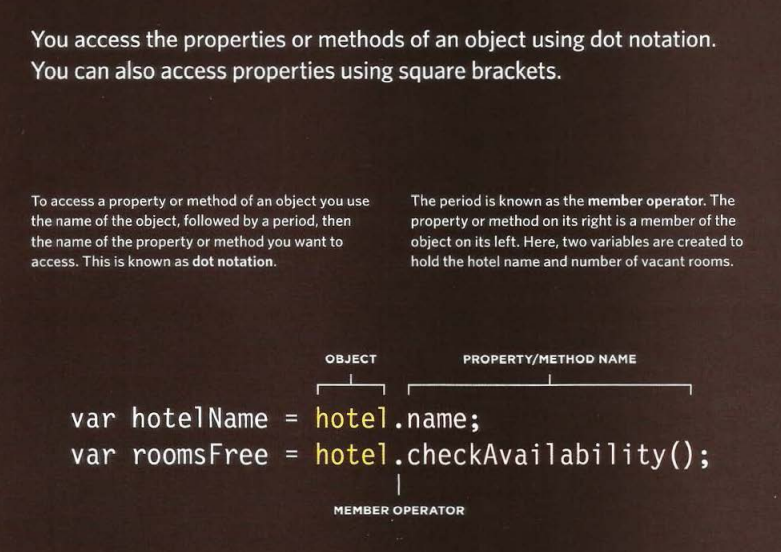

# **Understanding The Problem Domain**
What is the hardest thing about writing code?
- Learning a new technology.
- Naming things.
- Testing your code.
- Debugging.
- Fixing bugs.
- Making software maintainable.  
## **Why problem domains are hard**
Writing ***code** is a lot like putting together a jigsaw puzzle.  We put together code with the purpose of building components that we have taken out of the “bigger picture” of the problem domain.

The big issue is that many problem domains are like a puzzle with a blurry picture or no picture at all.

## **What can you do about it?**
1. Make the problem domain easier.
2. Get better at understanding the problem domain.
 ## **WHAT IS AN OBJECT**
 Objects group together a set of variables and functions to create a model 
of a something you would recognize from the real world. In an object, 
variables and functions take on new names. 

## **CREATING AN OBJECT :LITERAL NOTATION**  

## **ACCESSING AN OBJECT AND DOT NOTATION** 

## **DOCUMANT OBJECT MODEL**
The ***Document Object Model (DOM)*** specifies 
how browsers should create a model of an HTML 
page and how JavaScript can access and update the 
contents of a web page while it is in the browser window. 
## **DOM TREE**
As a browser loads a web page, it creates a model of that page. 
The model is called a DOM tree, and it is stored in the browsers' memory.   
It consists of four main types of nodes.  

&nbsp;
&nbsp;

Accessing and updating the DOM tree involves two steps: 
1. Locate the node that represents the element you want to work with. 
2. Use its text content, child elements, and attributes.