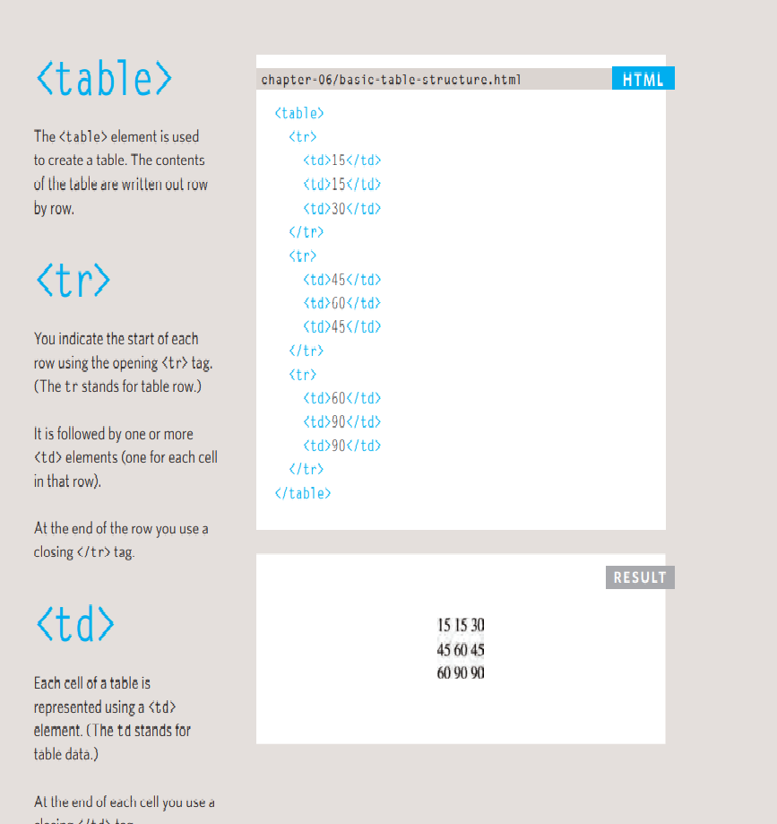
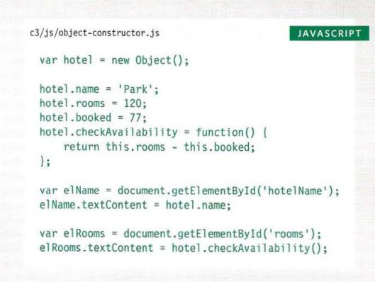

## **Domain Modeling**
Domain modeling is the process of creating a conceptual model in code for a specific problem. A model describes the various entities, their attributes and behaviors, as well as the constraints that govern the problem domain. An entity that stores data in properties and encapsulates behaviors in methods is commonly referred to as an object-oriented model.

A domain model that's articulated well can verify and validate the understanding of a specific problem among various stakeholders. As a communication tool, it defines a vocabulary that can be used within and between both technical and business teams.

## **What's a Table?**
A table represents information in a grid format. 
Examples of tables include financial reports, TV 
schedules, and sports results.
## **Basic Table Strucutre**

## **Spanning Column**
Sometimes you may need the 
entries in a table to stretch 
across more than one column.
The colspan attribute can be 
used on a "th" or "td" element 
and indicates how many columns 
that cell should run across.
## **Spanning Rows**
You may also need entries in 
a table to stretch down across 
more than one row.
The rowspan attribute can be 
used on a "th" or "td" element 
to indicate how many rows a cell 
should span down the table.
## **Long Tables**
There are three elements that 
help distinguish between the 
main content of the table and 
the first and last rows (which can 
contain different content).
These elements help people 
who use screen readers and also 
allow you to style these sections 
in a different manner than the 
rest of the table (as you will see 
when you learn about CSS).

## **CREATING OBJECTS USING CONSTRUCTOR SYNTAX**
an empty object 
called hote 1 is created using the 
constructor function. 
Once it has been created, three 
properties and a method are 
then assigned to the object. 
(If the object already had any 
of these properties, this would 
overwrite the values in those 
properties.) 
To access a property of this 
object, you can use dot notation, 
just as you can with any object. 
For example, to get the hotel's 
name you could use: 
hotel .name

## **CREATE & ACCESS OBJECTS CONSTRUCTOR NOTATION**

To get a better idea of why you 
might want to create multiple 
objects on the same page, here 
is an example that shows room 
availability in two hotels. 
First, a constructor function 
defines a template for the hotels. 
Next, two different instances 
of this type of hotel object are 
created. The first represents 
a hotel called Quay and the 
second a hotel called Park. 
## **RECAP: WAYS TO CREATE OBJECTS**
- CREATE THE OBJECT, THEN ADD PROPERTIES & METHODS 
- CREATING AN OBJECT WITH PROPERTIES & METHODS 

