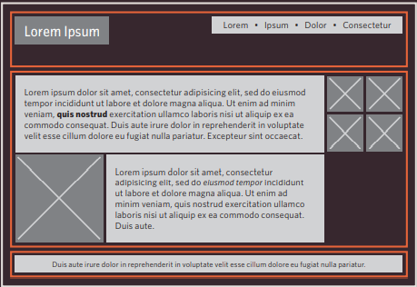
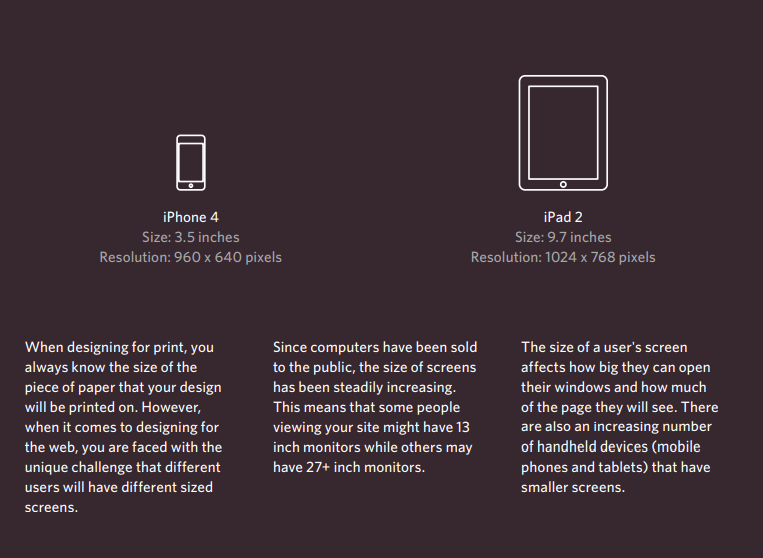

# **LayOut**
## **Key Concepts in Positioning Elements**
- ### ***Building Blocks***
CSS treats each HTML element as if it is in its 
own box. This box will either be a block-level
box or an inline box.  
Block-level boxes start on a new line and act as the main building blocks 
of any layout, while inline boxes flow between surrounding text. You can 
control how much space each box takes up by setting the width of the 
boxes (and sometimes the height, too). To separate boxes, you can use 
borders, margins, padding, and background colors. 
- ### ***Containing Elements***
If one block-level element sits inside another 
block-level element then the outer box is 
known as the containing or parent element.  
It is common to group a number of elements together inside a div
(or other block-level) element. For example, you might group together 
all of the elements that form the header of a site (such as the logo and 
the main navigation). The div element that contains this group of 
elements is then referred to as the containing element.

- ### ***Controlling the Position of Elements***
CSS has the following positioning schemes that allow you to control 
the layout of a page: normal flow, relative positioning, and absolute 
positioning. You specify the positioning scheme using the position
property in CSS. You can also float elements using the float property.  
- ### ***Normal flow***
in normal flow, each block-level 
element sits on top of the next 
one. Since this is the default 
way in which browsers treat 
HTML elements, you do not 
need a CSS property to indicate 
that elements should appear 
in normal flow.
- ### ***Relative Positioning***
Relative positioning moves an 
element in relation to where it 
would have been in normal flow.
For example, you can move it 10 
pixels lower than it would have 
been in normal flow or 20% to 
the right.
You can indicate that an element 
should be relatively positioned 
using the position property 
with a value of relative.

- ### ***Screen Sizes***
Different visitors to your site will have different sized screens that show 
different amounts of information, so your design needs to be able to 
work on a range of different sized screens.

