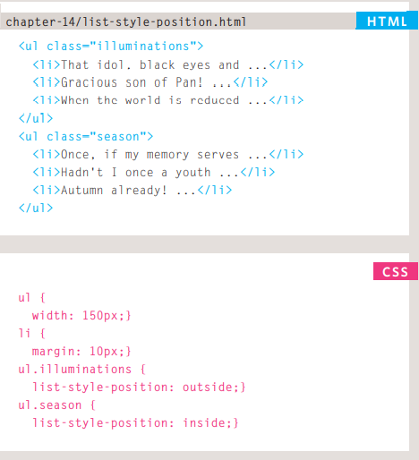

# **Forms**
## **Why Forms?**
The best known form on the web is probably 
the search box that sits right in the middle of 
Google's homepage.  
In addition to enabling users to 
search, forms also allow users 
to perform other functions 
online.  
 You will see forms 
when registering as a member 
of a website, when shopping 
online, and when signing up for 
newsletters or mailing lists.

## **Form control**
There are several types of form controls that 
you can use to collect information from visitors 
to your site.

## **how forms work**
1. A user fills in a form and then presses a button 
to submit the information to the server.
2. The name of each form 
control is sent to the 
server along with the 
value the user enters or 
selects.
3. The server processes 
the information using a 
programming language 
such as PHP, C#, VB.net, 
or Java. It may also store 
the information in a 
database.  
4. The server creates a new 
page to send back to the 
browser based on the 
information received.

# **Lists, Tables and Forms**
## **Bullet Point Styles**
- ### **list-style-type**
The list-style-type property 
allows you to control the shape 
or style of a bullet point (also 
known as a marker).  
- ### **list-style-image**
    You can specify an image to act 
as a bullet point using the
list-style-image property.
The value starts with the letters 
url and is followed by a pair 
of parentheses. Inside the 
parentheses, the path to the 
image is given inside double 
quotes.

- ### ***list-style-position***
Lists are indented into the page 
by default and the list-styleposition property indicates 
whether the marker should 
appear on the inside or the 
outside of the box containing the 
main points. 

- ### ***list-style***
As with several of the other CSS 
properties, there is a property 
that acts as a shorthand for list 
styles. It is called list-style, 
and it allows you to express 
the markers' style, image and 
position properties in any order.

# **Event**
## **DIFFERENT EVENT TYPES**

### ***HOW EVENTS TRIGGER JAVASCRIPT CODE***
1. Select t he element 
node(s) you want the 
script to respond to. 
2. Indicate which event on 
the selected node(s) will 
trigger the response. 
3. State the code you want 
to run when the event 
occurs.  

### ***USING DOM EVENT HANDLERS***
If you use a named function 
when the event fires on your 
chosen DOM node, write that 
function first. (You could also 
use an anonymous function.) 
The DOM element node is 
stored in a variable