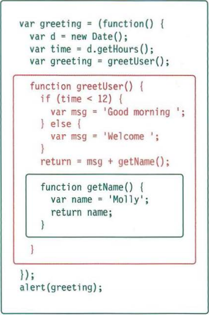
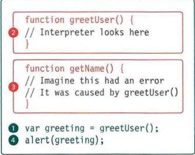

# **Error handling and debugging**
JavaScript can be hard to learn and everyone makes 
mistakes when writing it. This chapter will help you learn 
how to find the errors in your code. It will also teach you how 
to write scripts that deal with potential errors gracefully.   
 ## ***ORDER OF EXECUTION***
 To find the source of an error, it helps to know how scripts are processed. 
The order in which statements are executed can be complex; some tasks 
cannot complete until another statement or function has been run: 
1. The greeting variable gets its value from the 
greetUser() function. 
2. greetUser() creates the message by combining 
the string 'He 11 o ' with the result of getName (). 
3. getName () returns the name to greetUser()
4. greetUser() now knows the name, and combines 
it with the string. It then returns the message to the 
statement that called it in step 1. 
5. The value of the greeting is stored in memory
6. This greeting variable is written to an alert box. 

## **EXECUTUION CONTEXTS**
The JavaScript interpreter uses the concept of execution contexts. 
There is one global execution context; plus, each function creates a new 
new execution context. They correspond to variable scope. 

## **UNDERSTANDING SCOPE**
In the interpreter, each execution context has its own va ri ables object. 
It holds the variables, functions, and parameters available within it. 
Each execution context can also access its parent's v a ri ables object.

## **UNDERSTANDING ERRORS**
If a JavaScript statement generates an error, then it throws an exception. 
At that point, the interpreter stops and looks for exception-handl ing code.
If you are anticipating that something in your code 
may cause an error, you can use a set of statements 
to handle the error (you meet them on p480). 
This is important because if the error is not handled, 
the script will just stop processing and the user will 
not know why. So exception-handling code should 
inform users when there is a problem.   
 

## **HOW TO LOOK AT ERRORS IN CHROME**
The console will show you when there is an 
error in your JavaScript. It also displays the line 
where it became a problem for the interpreter. 

1. The Console option is selected. 
2. The type of error and the error 
message are shown in red. 
3. The file name and the line 
number are shown on the 
right-hand side of the console. 