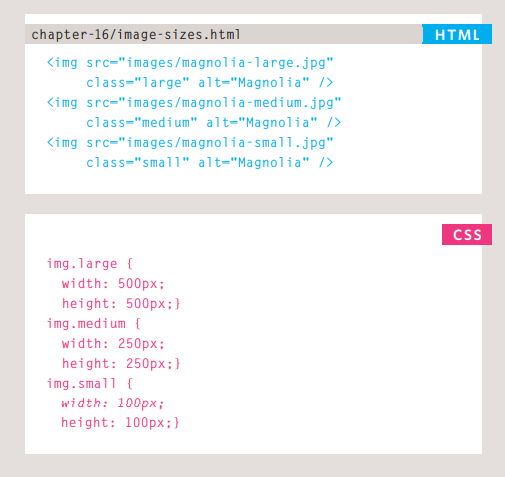
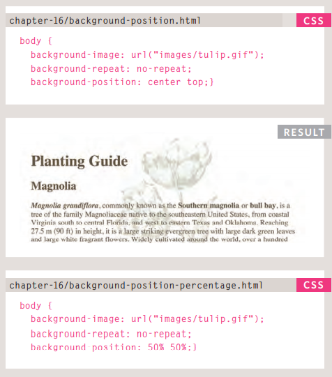

# **Images**
Controlling the size and alignment of 
your images using CSS keeps rules that 
affect the presentation of your page in 
the CSS and out of the HTML markup.
 ## Controlling the size of the image in CSS
 You can control the size of an 
image using the width and 
height properties in CSS, just 
like you can for any other box.   
Specifying image sizes helps 
pages to load more smoothly 
because the HTML and CSS 
code will often load before the 
images, and telling the browser 
how much space to leave for an 
image allows it to render the rest 
of the page without waiting for 
the image to download.

## Alingning images using CSS
In the last chapter, you saw how 
the float property can be used 
to move an element to the left or 
the right of its containing block, 
allowing text to flow around it.  
Rather than using the "img"
element's align attribute, web 
page authors are increasingly 
using the float property to align 
images. There are two ways that 
this is commonly achieved:

1. The float property is added 
to the class that was created to 
represent the size of the image 
(such as the small class in our 
example).
2. : New classes are created with 
names such as align-left or 
align-right to align the images 
to the left or right of the page. 
These class names are used in 
addition to classes that indicate 
the size of the image.

## **Background Position**
When an image is not being 
repeated, you can use the 
background-position
property to specify where in the 
browser window the background 
image should be placed. 
This property usually has a pair 
of values. The first represents 
the horizontal position and the 
second represents the vertical.

## **shorthand**
The background property acts 
like a shorthand for all of the 
other background properties 
you have just seen, and also the 
background-color property.
The properties must be specified 
in the following order, but you 
can miss any value if you do not 
want to specify it.
1. background-color
2. background-image
3. background-repeat
4. background-attachment
5. background-position.  
CSS3 will also support the use 
of multiple background images 
by repeating the background
shorthand. Because few 
browsers supported this 
property at the time of writing, it 
was not commonly used.
 
 ## **Search Engine Optimization (SEO)**
 SEO is a huge topic and several books have been written on the subject. 
The following pages will help you understand the key concepts so you can 
improve your website's visibility on search engines.  
- The Basics: Search engine optimization (or 
SEO) is the practice of trying 
to help your site appear nearer 
the top of search engine results 
when people look for the topics 
that your website covers.
At the heart of SEO is the idea of 
working out which terms people 
are likely to enter into a search 
engine to find your site and then 
using these terms in the right 
places on your site to increase 
the chances that search engines 
will show a link to your site in 
their results.  
 - On-Page Techniques: On-page techniques are the 
methods you can use on your 
web pages to improve their 
rating in search engines.
The main component of this is 
looking at keywords that people 
are likely to enter into a search 
engine if they wanted to find 
your site, and then including 
these in the text and HTML code 
for your site in order to help the 
search engines know that your 
site covers these topics.  

- Off-Page Techniques:Getting other sites to link to you 
is just as important as on-page 
techniques. Search engines help 
determine how to rank your 
site by looking at the number of 
other sites that link to yours.
They are particularly interested 
in sites whose content is related 
to yours. For example, if you 
were running a website that 
sold fish bait, then a link from 
a hairdresser is not likely to be 
considered as relevant as one 
from an angling community.  
## **How Many People Are Coming to Your Site?**
- Visits  :   
This is the number of times 
people have come to your site. If 
someone is inactive on your site 
for 30 minutes and then looks at 
another page on your site, it will 
be counted as a new visit.
- Unique Visits :    
This is the total number of 
people who have visited your site 
over the specified period. The 
number of unique visits will be 
lower than the number of visits 
if people have been returning to 
your site more than once in the 
defined period.  
- Page Views :   
The total number of pages all 
visitors have viewed on your site.

 - Pages per Visit:  
 The average number of pages 
each visitor has looked at on 
your site per visit.

