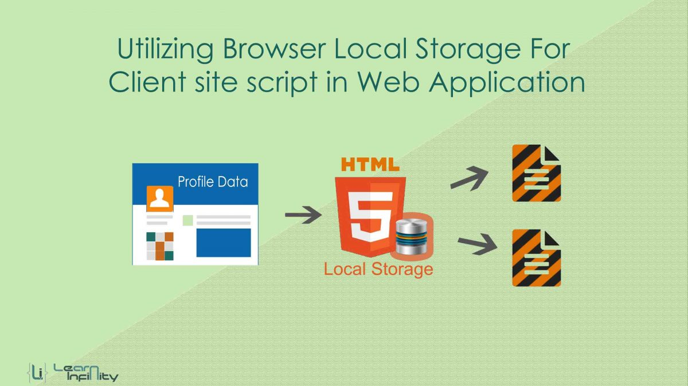

# **THE PAST, PRESENT & FUTURE OF LOCAL STORAGE FOR WEB APPLICATIONS**

## DIVING IN
ersistent local storage is one of the areas where native client applications have held an advantage over web applications. For native applications, the operating system typically provides an abstraction layer for storing and retrieving application-specific data like preferences or runtime state. These values may be stored in the registry, INI files, XML files, or some other place according to platform convention. If your native client application needs local storage beyond key/value pairs, you can embed your own database, invent your own file format, or any number of other solutions.

Historically, web applications have had none of these luxuries. Cookies were invented early in the web’s history, and indeed they can be used for persistent local storage of small amounts of data. But they have three potentially dealbreaking downsides:

- Cookies are included with every HTTP request, thereby slowing down your web application by needlessly transmitting the same data over and over.

- Cookies are included with every HTTP request, thereby sending data unencrypted over the internet (unless your entire web application is served over SSL)

- Cookies are limited to about 4 KB of data — enough to slow down your application (see above), but not enough to be terribly useful

What we really want is

- a lot of storage space
- on the client
- that persists beyond a page refresh
- and isn’t transmitted to the server
Before HTML5, all attempts to achieve this were ultimately unsatisfactory in different ways.


## USING HTML5 STORAGE
HTML5 Storage is based on named key/value pairs. You store data based on a named key, then you can retrieve that data with the same key. The named key is a string. The data can be any type supported by JavaScript, including strings, Booleans, integers, or floats. However, the data is actually stored as a string. If you are storing and retrieving anything other than strings, you will need to use functions like parseInt() or parseFloat() to coerce your retrieved data into the expected JavaScript datatype.
```html
interface Storage {
  getter any getItem(in DOMString key);
  setter creator void setItem(in DOMString key, in any data);
};
```


## BEYOND NAMED KEY-VALUE PAIRS: COMPETING VISIONS
While the past is littered with hacks and workarounds, the present condition of HTML5 Storage is surprisingly rosy. A new API has been standardized and implemented across all major browsers, platforms, and devices. As a web developer, that’s just not something you see every day, is it? But there is more to life than “5 megabytes of named key/value pairs,” and the future of persistent local storage is… how shall I put it… well, there are competing visions.

One vision is an acronym that you probably know already: SQL. In 2007, Google launched Gears, an open source cross-browser plugin which included an embedded database based on SQLite. This early prototype later influenced the creation of the Web SQL Database specification. Web SQL Database (formerly known as “WebDB”) provides a thin wrapper around a SQL database, allowing you to do things like this from JavaScript:
```html
openDatabase('documents', '1.0', 'Local document storage', 5*1024*1024, function (db) {
  db.changeVersion('', '1.0', function (t) {
    t.executeSql('CREATE TABLE docids (id, name)');
  }, error);
});
```


