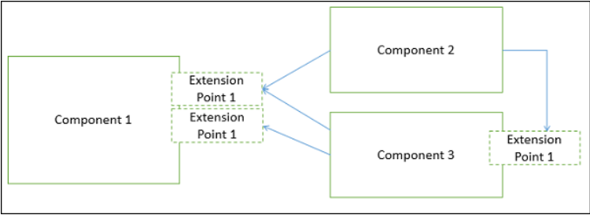

# **What is a Component?**
A **component** is a modular, portable, replaceable, and reusable set of well-defined functionality that encapsulates its implementation and exporting it as a higher-level interface.

A component is a software object, intended to interact with other components, encapsulating certain functionality or a set of functionalities. It has an obviously defined interface and conforms to a recommended behavior common to all components within an architecture.

A software component can be defined as a unit of composition with a contractually specified interface and explicit context dependencies only. That is, a software component can be deployed independently and is subject to composition by third parties.
## **Principles of Component−Based Design**
A component-level design can be represented by using some intermediary representation (e.g. graphical, tabular, or text-based) that can be translated into source code. The design of data structures, interfaces, and algorithms should conform to well-established guidelines to help us avoid the introduction of errors.

- The software system is decomposed into reusable, cohesive, and encapsulated component units.

- Each component has its own interface that specifies required ports and provided ports; each component hides its detailed implementation.

- A component should be extended without the need to make internal code or design modifications to the existing parts of the component.  



## **Passing Data Through Props**
In Board’s renderSquare method, change the code to pass a prop called value to the Square:
```html
class Board extends React.Component {
  renderSquare(i) {
    return <Square value={i} />;
  }
}
```
## **Developer Tools**
The React Devtools extension for Chrome and Firefox lets you inspect a React component tree with your browser’s developer tools.

The React DevTools let you check the props and the state of your React components.

After installing React DevTools, you can right-click on any element on the page, click “Inspect” to open the developer tools, and the React tabs (“⚛️ Components” and “⚛️ Profiler”) will appear as the last tabs to the right. Use “⚛️ Components” to inspect the component tree.

However, note there are a few extra steps to get it working with CodePen:

1. Log in or register and confirm your email (required to prevent spam)
2. Click the “Fork” button.
3. Click “Change View” and then choose “Debug mode”.
4. In the new tab that opens, the devtools should now have a React tab.

## ***Hello World***
```html
ReactDOM.render(
  <h1>Hello, world!</h1>,
  document.getElementById('root')
);
```
It displays a heading saying “Hello, world!” on the page.

Try it on CodePen

Click the link above to open an online editor. Feel free to make some changes, and see how they affect the output. Most pages in this guide will have editable examples like this one.

### **Introducing JSX**
```html
const element = <h1>Hello, world!</h1>;
```
React embraces the fact that rendering logic is inherently coupled with other UI logic: how events are handled, how the state changes over time, and how the data is prepared for display.

Instead of artificially separating technologies by putting markup and logic in separate files, React separates concerns with loosely coupled units called “components” that contain both. We will come back to components in a further section, but if you’re not yet comfortable putting markup in JS, this talk might convince you otherwise.

React doesn’t require using JSX, but most people find it helpful as a visual aid when working with UI inside the JavaScript code. It also allows React to show more useful error and warning messages.
## **Rendering an Element into the DOM**

We call this a “root” DOM node because everything inside it will be managed by React DOM.

Applications built with just React usually have a single root DOM node. If you are integrating React into an existing app, you may have as many isolated root DOM nodes as you like.

To render a React element into a root DOM node, pass both to ReactDOM.render():

```html
const element = <h1>Hello, world</h1>;
ReactDOM.render(element, document.getElementById('root'));
```
## **Updating the Rendered Element**
React elements are immutable. Once you create an element, you can’t change its children or attributes. An element is like a single frame in a movie: it represents the UI at a certain point in time.

With our knowledge so far, the only way to update the UI is to create a new element, and pass it to ReactDOM.render().

## **Components and Props**
Components let you split the UI into independent, reusable pieces, and think about each piece in isolation. This page provides an introduction to the idea of components. You can find a detailed component API reference here.

## **Function and Class Components**
The simplest way to define a component is to write a JavaScript function:

```html
function Welcome(props) {
  return <h1>Hello, {props.name}</h1>;
}
```
This function is a valid React component because it accepts a single “props” (which stands for properties) object argument with data and returns a React element. We call such components “function components” because they are literally JavaScript functions.  


