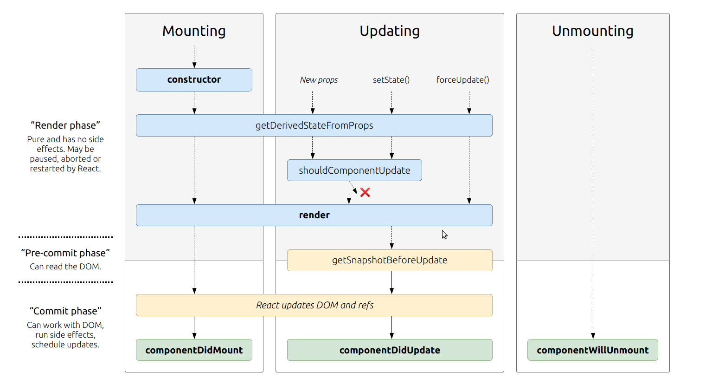
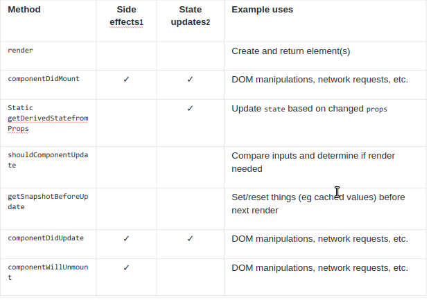

# **React: Component Lifecycle Events**
What are component lifecycle events?
React lets you define components as classes or functions. The methods that you are able to use on these are called lifecycle events. These methods can be called during the lifecycle of a component, and they allow you to update the UI and application states.  

Mounting, Updating, and Unmounting are the three phases of the component lifecycle.

## **Mounting**
When an instance of a component is being created and inserted into the DOM it occurs during the mounting phase. Constructor, static getDerivedStateFromProps, render, componentDidMount, and UNSAFE_componentWillMount all occur in this order during mounting.
## **Updating**
Anytime a component is updated or state changes then it is rerendered. These lifecycle events happen during updating in this order.
static getDerivedStateFromProps, shouldComponentUpdate, render,
getSnapshotBeforeUpdate, componentDidUpdate, UNSAFE_componentWillUpdate, UNSAFE_componentWillReceiveProps.

## **Unmounting**
The final phase of the lifecycle if called when a component is being removed from the DOM. componentWillUnmount is the only lifecycle event during this phase.

- Rebuilt with React  
React-Bootstrap replaces the Bootstrap JavaScript. Each component has been built from scratch as a true React component, without unneeded dependencies like jQuery.
As one of the oldest React libraries, React-Bootstrap has evolved and grown alongside React, making it an excellent choice as your UI foundation.  

- Bootstrap at its core    
Built with compatibility in mind, we embrace our bootstrap core and strive to be compatible with the world's largest UI ecosystem.  
By relying entirely on the Bootstrap stylesheet, React-Bootstrap just works with the thousands of Bootstrap themes you already love.

- Accessible by default  
The React component model gives us more control over form and function of each component.
Each component is implemented with accessibility in mind. The result is a set of accessible-by-default components, over what is possible from plain Bootstrap.

