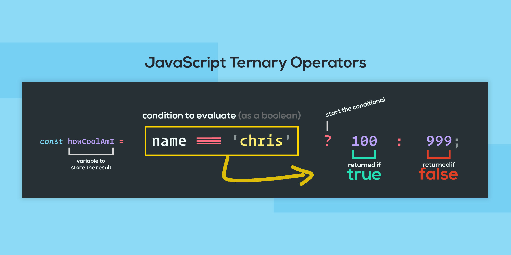

# **Forms**
HTML form elements work a bit differently from other DOM elements in React, because form elements naturally keep some internal state. For example, this form in plain HTML accepts a single name:

```html
<form>
  <label>
    Name:
    <input type="text" name="name" />
  </label>
  <input type="submit" value="Submit" />
</form>
```
## **Controlled Components**
In HTML, form elements such as ```<input>```, ```<textarea>```, and ```<select>``` typically maintain their own state and update it based on user input. In React, mutable state is typically kept in the state property of components, and only updated with setState().

We can combine the two by making the React state be the “single source of truth”. Then the React component that renders a form also controls what happens in that form on subsequent user input. An input form element whose value is controlled by React in this way is called a “controlled component”.

For example, if we want to make the previous example log the name when it is submitted, we can write the form as a controlled component:

```html  
class NameForm extends React.Component {
  constructor(props) {
    super(props);
    this.state = {value: ''};

    this.handleChange = this.handleChange.bind(this);
    this.handleSubmit = this.handleSubmit.bind(this);
  }

  handleChange(event) {
    this.setState({value: event.target.value});
  }

  handleSubmit(event) {
    alert('A name was submitted: ' + this.state.value);
    event.preventDefault();
  }

  render() {
    return (
      <form onSubmit={this.handleSubmit}>
        <label>
          Name:
          <input type="text" value={this.state.value} onChange={this.handleChange} />
        </label>
        <input type="submit" value="Submit" />
      </form>
    );
  }
}
```
## **The select Tag**
In HTML, ```<select>``` creates a drop-down list. For example, this HTML creates a drop-down list of flavors:
```html
<select>
  <option value="grapefruit">Grapefruit</option>
  <option value="lime">Lime</option>
  <option selected value="coconut">Coconut</option>
  <option value="mango">Mango</option>
</select>
```
Note that the Coconut option is initially selected, because of the selected attribute. React, instead of using this selected attribute, uses a value attribute on the root select tag. This is more convenient in a controlled component because you only need to update it in one place. For example:


## **JavaScript — The Conditional (Ternary) Operator Explained**
Starting With the Basics — The if statement
Using a conditional, like an if statement, allows us to specify that a certain block of code should be executed if a certain condition is met.
Consider the following example:
We have a person object that consists of a name, age, and driver property.
```html
let person = {
  name: 'tony',
  age: 20,
  driver: null
};
```

The ```<FormControl>``` component renders a form control with Bootstrap styling. The ```<FormGroup>``` component wraps a form control with proper spacing, along with support for a label, help text, and validation state. To ensure accessibility, set controlId on ```<FormGroup>```, and use ```<FormLabel>``` for the label.
```html
<Form>
  <Form.Group className="mb-3" controlId="formBasicEmail">
    <Form.Label>Email address</Form.Label>
    <Form.Control type="email" placeholder="Enter email" />
    <Form.Text className="text-muted">
      We'll never share your email with anyone else.
    </Form.Text>
  </Form.Group>

  <Form.Group className="mb-3" controlId="formBasicPassword">
    <Form.Label>Password</Form.Label>
    <Form.Control type="password" placeholder="Password" />
  </Form.Group>
  <Form.Group className="mb-3" controlId="formBasicCheckbox">
    <Form.Check type="checkbox" label="Check me out" />
  </Form.Group>
  <Button variant="primary" type="submit">
    Submit
  </Button>
</Form>
```
## **Form controls**
- Sizing
- Readonly
- Readonly plain text


